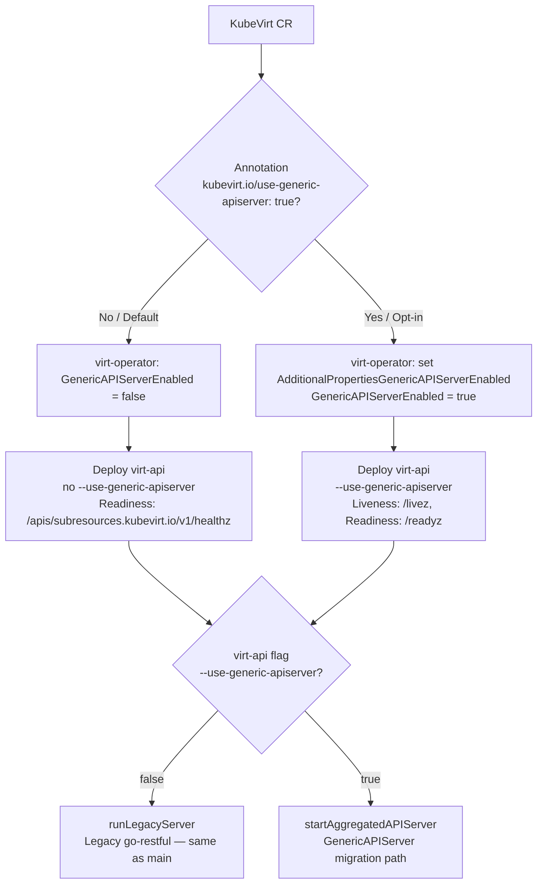

  

# GSoC 2026 Kubevirt :Migrating KubeVirt virt-api to k8s.io/apiserver (GenericAPIServer)

Contributor: Changlin Hu 

Mentors: [Luboslav Pivarc,](https://github.com/xpivarc?tab=overview&from=2023-12-01&to=2023-12-31) [Felix Matouschek](https://github.com/0xFelix)

Organization: KubeVirt

Project: https://summerofcode.withgoogle.com/programs/2026/projects/6mDtvgRu

## Introduction

During this summer, I had the incredible opportunity to contribute to the KubeVirt community on mostly the control plane, specifically virt-api, the aggregated API server that serves [subresources.kubevirt.io](http://subresources.kubevirt.io/) operations (console, VNC, start/stop, hotplug, SEV, webhooks, and more). Before the migration, virt-api implemented TLS, authentication, authorization, discovery, and OpenAPI largely by hand on top of the go-restful and a custom authorizer. That duplicated work that [k8s.io/apiserver](http://k8s.io/apiserver) already provides and made security updates and Kubernetes version bumps harder.

The project goal was to design and deliver a working migration of subresources and admission webhooks onto that stack, keeping KubeVirt business logic, but removing the hand rolled server layers where the upstream library can take over.

This evaluation summarizes the goals, the migration path from skeleton to full endpoint cutover and cleanup, the hard problems I hit, what shipped, and what is still open. At the time of writing, the main migration [PR](https://github.com/kubevirt/kubevirt/pull/18607) is not merged yet. After hitting several CI and dual path issues late in the summer, we adjusted the plan as follow. Ship GenericAPIServer as an opt-in behind a KubeVirt CR annotation, keep the legacy go-restful server as the default, then clear remaining gaps and switch the default later. hope this post can help you out!

## Project Overview

KubeVirt stores VirtualMachine / VirtualMachineInstance objects in kube-apiserver as CRDs. Creating or deleting a VM does not go through virt-api. virt-api matters when you operate on a running guest: console, VNC, start/stop/restart/migrate, volume hotplug, SEV flows, and admission webhooks. Those operations go beyond the CRUD model CRDs provide so KubeVirt needs a separate aggregated API server ([subresources.kubevirt.io](http://subresources.kubevirt.io/)) that the kube-apiserver aggregator proxies to. The core goal of this project was landing a drop-in replacement, same URLs, same auth expectations, same operator-facing behavior while TLS, authn, authz, discovery, and OpenAPI come from [k8s.io/apiserver](http://k8s.io/apiserver) instead of the legacy server.

Before the migration, request roughly went through:

1. Configured TLS
2. Custom requestheader / auth wiring
3. A custom authorizer that that issued SAR calls to kube-apiserver
4. Hand-built / manually registered discovery and OpenAPI routes
5. composeSubresources() + http.HandleFunc for webhooks on DefaultServeMux

After migration the same business handlers sit behind GenericAPIServer’s standard request filters with subresources as rest.Storage and webhooks on the NonGoRestfulMux.

### High-level Goal

1. Document in a VEP why virt-api should adopt k8s.io/apiserver, what to remove, what should  kept and how streaming, non-streaming subresources, webhooks, health/metrics, and OpenAPI map onto GenericAPIServer.
2. Move subresources and admission webhooks onto GenericAPIServer without changing user-visible API behavior.
3. Prefer an opt-in cutover first then remove dual paths once CI and behavioral gaps are cleared.
4. keep track of the Prow jobs, should be green on the migration PR.

### How I approached it

- Skeleton under pkg/virt-api/apiserver
- Endpoint-by-endpoint migration onto rest.Storage / mux handlers
- Infrastructure cutover (discovery/auth, /livez/readyz, OpenAPI)
- Cleanup of obsolete rest/ authorizer / compose paths
- Unit + port-forward auth tests, chase required CI

### Skills and Technology stack

- Go: virt-api, controllers adjacent packages, Bazel/BUILD maintenance
- Kubernetes aggregated API servers: [k8s.io/apiserver](http://k8s.io/apiserver), rest.Storage, request filters, TokenReview / SAR delegation
- KubeVirt internals: VMI/VM subresources, streaming to virt-handler, admission webhooks, operator manifests / probes
- OpenAPI / client generation: tools/openapispec, apidocs / python client pipeline impact
- Testing:
    - Go unit tests against real filter chains
    - Ginkgo e2e
    - port-forward-based auth functests
    - reading Prow (build-verify, generate, unit, e2e)

## Key Contributions

1. GenericAPIServer skeleton (pkg/virt-api/apiserver) https://github.com/kubevirt/kubevirt/pull/18607
    
    Ref: **inspired by virt-template / sample-apiserver** https://github.com/kubevirt/virt-template
    Before moving endpoints, we needed a server object that could:
    
    - Install [subresources.kubevirt.io](http://subresources.kubevirt.io/) API groups for v1 and v1alpha3
    - Accept rest.Storage maps per resource
    - Register plain handlers (WithMuxHandlers) for webhooks and odd HTTP shapes
    - Configure delegated authn/authz and AlwaysAllow path lists
    - Mark long-running connections so streaming is not killed by request timeouts
    - Expose /livez / /readyz for Deployment probes while preserving KubeVirt’s config-aware /healthz semantics where needed
    - This scaffolding made later PRs incremental: each endpoint migration was “add Storage + delete legacy route,” not “redesign the server again.”
2. Endpoint migration https://github.com/kubevirt/kubevirt/pull/18607
Most subresources mapped cleanly to rest.Connecter (PUT/GET with options / streaming upgrade) or rest.Getter (e.g. expand-spec). Please check the details in the route mapping table below: 
    
    [https://docs.google.com/document/d/1J6hVxM6Do_fETraCEZhQ7ajJJGvFxHo1FclD7906I9Q/edit?tab=t.0#heading=h.bxhy1037jheq](https://docs.google.com/document/d/1J6hVxM6Do_fETraCEZhQ7ajJJGvFxHo1FclD7906I9Q/edit?tab=t.0#heading=h.bxhy1037jheq)
    
    Webhooks stayed as the same admitter functions, but registration moved from http.HandleFunc on the default mux to WithMuxHandlers on NonGoRestfulMux.
    
3. Cleanup and package layout https://github.com/kubevirt/kubevirt/pull/18607
After routes lived on GenericAPIServer I removed legacy pieces
    - Removed composeSubresources() as the primary registration path
    - Dropped the temporary legacy bridge once /healthz and /metrics were on GenericAPIServer
    - Cleaned custom authorizer / dialer / expand / streamer leftovers from pkg/virt-api/rest where no longer needed
    - Reorganized code so each feature’s Connecter sits next to its logic (storage/virtualmachine/..., storage/virtualmachineinstance/..., apiserver/cluster/...) while shared streaming stays in pkg/virt-api/streaming
4. Authn/authz tests (follow-up PR: https://github.com/kubevirt/kubevirt/pull/18823)
    - Unit: drive the real GenericAPIServer filter order with fake delegated authn/authz; assert 401/403 vs AlwaysAllow bypass, including the resource-request AlwaysAllow case
    - Functional: port-forward to a virt-api pod :8443 and send HTTPS directly, bypassing the aggregator, so virt-api’s own filters are under test
    
    I also evaluated lyarwood’s envtest controller harness (#18726): https://github.com/kubevirt/kubevirt/pull/18726
    
    It is a useful pattern (real apiserver without a full cluster) but aimed at VM/VMI controllers, not aggregated virt-api + requestheader CA. A third layer (envtest as TokenReview/SAR backend + in-process virt-api) remains an open mentor question.
    

### Current Status

The migration is not in main yet, endpoint migration and cleanup are substantially complete on the PR branch. Auth tests live in a follow-up stacked on top of it. Both are still under review and Prow.

### Future Work

- Land #18607 as an opt-in with required Prow green and mentor lgtm / approve
- Clear any remaining behavioral gaps exposed by e2e and review
- make GenericAPIServer the default once opt-in has soaked
- Rebase and land #18823 (auth unit + port-forward functests) after migration
- Document nested OpenAPI path limitations for consumers
- Remove leftover legacy helpers if review still finds any
- Broader docs/tutorials for future contributors if needed

## Acknowledgements

I would like to give a huge shout-out to my mentors, Luboslav Pivarc and Felix Matouschek, and to the KubeVirt community for reviews, /test triggers, and design feedback throughout the summer🎉! I look forward to seeing the migration merge and I hope to continue to stay engaged with the community and contribute for the long running.
